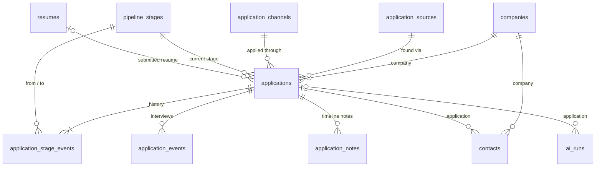

# Job CRM — Project Context

> **Read this before changing anything.** This is the handoff document for AI agents and new contributors: what the product is, why it exists, how it is built, which rules the database enforces, and what is known to be broken.
>
> Verified against commit `85b4d2e` on **2026-09-16**. If the code and this document disagree, the code wins — then update this document.

## Contents

1. [What this product is](#1-what-this-product-is)
2. [Domain model in plain words](#2-domain-model-in-plain-words)
3. [Tech stack](#3-tech-stack)
4. [Repository map](#4-repository-map)
5. [Architecture and conventions](#5-architecture-and-conventions)
6. [Routes and screens](#6-routes-and-screens)
7. [Database](#7-database)
8. [Key workflows](#8-key-workflows)
9. [Analytics: exact metric definitions](#9-analytics-exact-metric-definitions)
10. [AI subsystem (optional)](#10-ai-subsystem-optional)
11. [Environment variables](#11-environment-variables)
12. [Running, testing, deploying](#12-running-testing-deploying)
13. [Rules for agents](#13-rules-for-agents)
14. [Known issues and backlog](#14-known-issues-and-backlog)

---

## 1. What this product is

**Job CRM** is a private job-search tracker built as a lightweight personal CRM / applicant-tracking system.

The owner used to track applications in a spreadsheet (company, position, date applied, status). A single sheet could not answer the questions that matter in a high-volume search:

- **Where did I find this job** (LinkedIn, Indeed, a referral…) versus **where did I actually apply** (LinkedIn Easy Apply, Indeed Apply, email, the company careers page…)? These are two different facts.
- **Which platforms actually get me responses and interviews**, so I can focus my effort there?
- **What stage is each response at** — screening, first interview, technical interview, offer?
- **What did the job description say** when a company replies weeks later, so I can prepare?
- **Which resume version did I send?**

This app answers those questions. It lets the owner search any application by company or role, see the full history of each one, and see which discovery sources and application channels perform best.

**Usage reality:** the owner has used it daily for about two months, logging **10–20 applications per day**. The daily charts are part of the motivation to keep applying. Expect **1,000+ applications per user within a few months**, and design queries for that volume.

**Near-term plan:** fix issues and polish, publish a LinkedIn post about the project, then expand it.

**Names in use** (inconsistent — see [§14](#14-known-issues-and-backlog)): the README title is "Casefile — Job Search CRM", the app metadata says "Job CRM", the auth screen says "Job Search CRM", the npm package is `job-crm`, and the GitHub repo is `codewithfaraz/job-application-tracker`.

### Product principles

These are deliberate decisions. Keep them unless the owner says otherwise.

| Principle | What it means in code |
|---|---|
| History is the source of truth | Each application has a current stage **and** an immutable log of stage events. Analytics are computed from the log, never from the current label alone. |
| The job description is archived exactly | `applications.raw_job_description` is stored exactly as pasted. AI never overwrites it. |
| Source ≠ channel | "Found via" (`application_sources`) and "Applied through" (`application_channels`) are independent dimensions. |
| Analytics are deterministic | Dashboards and analytics never call AI. |
| AI is optional and explicit | AI runs only when the user clicks, only on text the user stored or pasted. Saved job URLs are never fetched. No scraping. |
| Security lives in the database | Multi-user with Row Level Security and composite ownership foreign keys. There is no service-role key anywhere. |

---

## 2. Domain model in plain words

| Concept | Meaning | Table |
|---|---|---|
| **Application** ("case file") | One job saved or applied to. Belongs to a company; has a discovery source, an application channel, a current stage, an optional submitted resume, the raw job description (JD), notes, and salary / location / work-mode metadata. | `applications` |
| **Company** | Found-or-created by name when an application is saved (case- and whitespace-insensitive). Website, industry, location, and notes are editable from the case file. There is no standalone companies page. | `companies` |
| **Discovery source** — "Found via" | Where the posting was found. | `application_sources` |
| **Application channel** — "Applied through" | How the application was submitted. | `application_channels` |
| **Pipeline stage** | A user-owned stage (name, order, terminal flag) mapped to a fixed **category**. Analytics use the category, so stages can be renamed freely. | `pipeline_stages` |
| **Stage event** | Immutable history row: from stage → to stage, when, and optional notes. The first event has `from_stage_id = null`. | `application_stage_events` |
| **Saved vs Applied** | A new record starts either as **Saved** (a lead; no `applied_at`) or **Applied** (`applied_at` required). Analytics count only records that have ever reached an Applied-category stage. | — |
| **Archive vs delete** | Archive (`archived_at`) is reversible and keeps history; archived records still count in analytics by default. Delete is permanent and cascades. | — |
| **"No response yet"** | Derived, never stored: currently Applied, not archived, never reached a response stage, and applied at least `profiles.no_response_days` (default 21) days ago. It never moves a record to Ghosted. | — |
| **Contact** | A person (recruiter, hiring manager) tied to an application **and** that application's company. | `contacts` |
| **Interview / event** | A scheduled call, interview, assessment, or follow-up with start/end time, meeting link, location, and a completed flag. Feeds the calendar and dashboard. | `application_events` |
| **Timeline note** | A timestamped note on an application. Separate from the single free-text `applications.notes` field. | `application_notes` |
| **Resume version** | An immutable uploaded file (PDF, DOCX, or TXT) plus its extracted text. Can be archived. An application points at the exact version that was sent. | `resumes` + Storage bucket `resumes` |
| **AI run** | Audit and cache record of one AI operation. | `ai_runs` |
| **Profile** | Display name, IANA timezone, and no-response threshold. Created automatically at signup. | `profiles` |

### Defaults seeded for every new user

Seeded by `private.seed_user_defaults` when the auth user is created.

**Discovery sources (9):** LinkedIn, Indeed, Company Careers Page, Recruiter Outreach, Email Outreach, Referral, Glassdoor, Other Job Board, Other.

**Application channels (12):** Company Careers Page, LinkedIn Easy Apply, Indeed Apply, Email, Recruiter, Referral, Greenhouse, Lever, Ashby, Workday, Other ATS, Other.

**Pipeline stages (14):**

| `sort_order` | Stage | Category | Terminal |
|---:|---|---|:---:|
| 10 | Saved | `saved` | |
| 20 | Applied | `applied` | |
| 30 | Screening | `screening` | |
| 40 | 1st Interview | `interview` | |
| 50 | Technical Assessment | `assessment` | |
| 60 | Technical Interview | `interview` | |
| 70 | 2nd Interview | `interview` | |
| 80 | Final Interview | `interview` | |
| 90 | Offer | `offer` | |
| 100 | Accepted | `accepted` | ✓ |
| 110 | Rejected | `rejected` | ✓ |
| 120 | Withdrawn | `withdrawn` | ✓ |
| 130 | Ghosted | `ghosted` | ✓ |
| 140 | Closed | `closed` | ✓ |

> ⚠️ There is currently **no UI** to add, rename, reorder, or deactivate sources, channels, or stages. Only these seeds exist; changing them requires SQL. See [§14](#14-known-issues-and-backlog).

---

## 3. Tech stack

| Area | Choice |
|---|---|
| Framework | **Next.js 16.3.1** App Router, React 19.2, strict TypeScript. ⚠️ Next 16 has breaking changes compared with older training data. Read the relevant guide in `node_modules/next/dist/docs/` before writing Next.js code (required by `AGENTS.md`). The app uses `proxy.ts` (Next 16's replacement for `middleware.ts`), and `params` / `searchParams` are Promises. |
| UI | Tailwind CSS 4 with CSS-first tokens in `app/globals.css`; shadcn-style primitives in `components/ui` ("new-york" style); Radix alert-dialog, tabs, and slot; lucide-react icons; sonner toasts; Recharts (line, bar, Sankey). Fonts via `next/font/google`: Bricolage Grotesque (display), Public Sans (body), IBM Plex Mono (labels). Light theme only. |
| Backend | Supabase: email/password Auth, Postgres 17, Row Level Security, private Storage, SQL RPC functions. Accessed through `@supabase/ssr` using **only the signed-in user's JWT**. |
| Validation | Zod 4 (`lib/validation/*`). |
| Forms | Native `<form action>` + Server Actions + React `useActionState`. |
| AI (optional) | Vercel AI SDK v7 (`ai`) + `@ai-sdk/openai`, structured output validated with Zod. |
| Resume parsing | `pdfjs-dist` (legacy build, server-side) and `mammoth` (DOCX). |
| Tests | Vitest 4 + jsdom + Testing Library; pgTAP for the database. |
| Runtime | Node ≥ 22.13 (the owner runs Node 24). Deploy target: Vercel + hosted Supabase. |

**Declared but never imported** (safe-removal candidates): `react-hook-form`, `@hookform/resolvers`, `@radix-ui/react-dialog`, `@radix-ui/react-dropdown-menu`, `@radix-ui/react-select`, `@radix-ui/react-label`, `date-fns`. The README's stack list still mentions some of them.

---

## 4. Repository map

```text
proxy.ts                      Next 16 proxy: refreshes the Supabase session, guards routes
app/
  layout.tsx                  Root layout: fonts, metadata ("Job CRM"), skip link, <AppToaster/>
  page.tsx                    Public marketing landing page (static sample case file)
  globals.css                 Tailwind 4 theme tokens (evergreen / cobalt / amber / rose / paper)
  (auth)/login, (auth)/signup Auth pages -> components/auth/auth-form.tsx
  auth/callback/route.ts      PKCE code exchange
  auth/confirm/route.ts       Email token-hash confirmation
  (dashboard)/layout.tsx      requireVerifiedIdentity + <AppShell> (sidebar nav, global search)
  (dashboard)/dashboard       KPI overview
  (dashboard)/applications    List, new, [id] case file, [id]/edit
  (dashboard)/pipeline        Stage-column board
  (dashboard)/calendar        Upcoming interviews
  (dashboard)/analytics       Full analytics
  (dashboard)/resumes         Resume library + [id]/download route (signed URL)
  (dashboard)/settings        Profile settings
actions/                      Server Actions ("use server") — ALL writes go through here
  applications.ts             Create / update / archive / restore / delete (+ company upsert, duplicate check)
  pipeline.ts                 transitionApplicationStageAction -> RPC transition_application_stage
  crm.ts                      Contacts, interviews/events (incl. mark complete), timeline notes
  companies.ts                Company details editor
  resumes.ts                  Reserve -> finalize upload, cancel, archive/restore, delete
  ai.ts                       Pasted-JD extraction, saved-JD extraction, resume comparison, interview prep
  settings.ts, auth.ts        Profile settings; sign in / sign up / sign out
lib/
  supabase/                   Env config, server/browser clients, proxy session logic, auth helpers, safe redirects
  data/                       Server-only READ loaders used by pages (each calls requireVerifiedIdentity)
  analytics/                  Pure, unit-tested aggregation (aggregate.ts), Sankey builder (sankey.ts), types
  pipeline/                   Pure helpers: group applications by stage, merge the activity timeline
  validation/                 Zod schemas: application, crm, settings, auth, resume
  ai/                         Config/policy, provider, versioned prompts, output schemas, services, cache key
  resumes/extract-text.server.ts   Hardened PDF / DOCX / TXT text extraction
components/
  applications/               Form (create/edit), list, filters, case-file detail, record actions, copy button
  pipeline/                   Board, stage-change form
  crm/                        Contacts / interviews / notes panels, company editor
  analytics/                  Recharts charts, conversion grid, effectiveness table, metric card
  ai/                         AI workbench tabs and panels, result renderers, form JD analyzer, history
  resumes/  settings/  auth/  layout/ (app shell, nav, brand mark, route spine)  ui/ (primitives)
types/database.ts             Supabase-generated DB types — HAND-PATCHED, see §13
supabase/
  migrations/20260818000000_initial_schema.sql   The entire schema (one migration, ~2,460 lines)
  seed.sql                    Opt-in demo data for one existing user (5 companies)
  tests/database/job_crm_foundation.test.sql      pgTAP suite (75 assertions)
  config.toml                 Local Supabase config (seeding disabled, API max_rows = 1000)
  .temp/                      Supabase CLI link cache — committed by mistake, see §14
```

---

## 5. Architecture and conventions

```text
Browser ──► proxy.ts ──► lib/supabase/proxy.ts   (getClaims, refresh cookies, send guests to /login)
   │
   ├── Server Component page ──► lib/data/*.ts  (requireVerifiedIdentity → select … .eq("user_id")) ──► Postgres + RLS
   │
   └── Client form ──► actions/*.ts  (Zod → requireVerifiedIdentity → insert / update / RPC) ──► Postgres triggers + RPCs
                             └──► revalidatePath(…) then redirect, or return an action state → toast
```

- **Reads** live in `lib/data/*` (all `server-only`). **Writes** live in `actions/*` only.
- **Defense in depth:** every query filters `.eq("user_id", userId)` **and** RLS enforces ownership. Never add a service-role or secret key.
- **Business rules live in Postgres** (triggers and RPCs). TypeScript validation mirrors them to show friendly errors. When they disagree, the database wins.
- **Action state shape:** `{ status, message?, fieldErrors? }`, consumed with `useActionState`; feedback is shown with `sonner` toasts.
- **Pure logic is separated and unit-tested:** `lib/analytics`, `lib/pipeline`, `lib/validation`, and `lib/ai/{schemas,prompts,cache-key,config-policy}`.
- **Route protection:** the prefixes `/dashboard`, `/applications`, `/pipeline`, `/calendar`, `/analytics`, `/resumes`, `/settings` are protected in `lib/supabase/proxy.ts`. Signed-in users visiting `/login` or `/signup` are sent to `/dashboard`. Every redirect target passes through `sanitizeRedirectPath` (open-redirect safe).
- Every `(dashboard)` route renders dynamically (`force-dynamic` layout) and has a `loading.tsx`; several also have `error.tsx`.
- **Visual language:** a "case desk / case file" metaphor with mono uppercase eyebrow labels such as `Case desk / Pipeline`. Keep new screens consistent with it.

---

## 6. Routes and screens

| Route | What the user sees | Loader | Writes |
|---|---|---|---|
| `/` | Public landing page | — | — |
| `/login`, `/signup` | Email/password auth | `getVerifiedIdentity` | `actions/auth.ts` |
| `/auth/callback`, `/auth/confirm` | Code-exchange and email-confirmation route handlers | — | — |
| `/dashboard` | KPI cards (Applications, Responses, Interviews, each with a rate — the Offers card was deliberately removed from the dashboard; offers still appear on `/analytics` and in the data layer), Active and No-response badges, monthly applications chart, active pipeline counts, next 5 upcoming interviews, most-used source and channel | `getDashboardOverview` | — |
| `/applications` | Search by company or role; filters for stage, source, channel, work mode, and active / archived / all; sort; pagination (25 per page) | `listApplications`, `getApplicationFormOptions` | — |
| `/applications/new` | **Quick entry:** company, role, found via, applied through, Saved/Applied, date. **More details:** URL, location, work mode, employment type, seniority, salary, raw JD (with optional AI analyzer), notes, resume. Shows a duplicate warning with "Create anyway". | `getApplicationFormOptions` | `createApplicationAction`, `analyzePastedJobDescriptionAction` |
| `/applications/[id]` | **Case file:** route spine (found → applied → current), original JD with copy button, notes, merged activity timeline, stage mover, details, AI workbench (3 tabs + saved history), contacts / interviews / timeline notes, company editor, archive / restore / delete | `getApplicationDetail`, `getApplicationAIHistory` | pipeline, crm, companies, ai, and applications actions |
| `/applications/[id]/edit` | Full edit form, including the stage select and applied date | `getApplicationDetail` | `updateApplicationAction` |
| `/pipeline` | One column per stage for non-archived applications. Each card has a stage `<select>` and a Move button (no drag-and-drop). | `getPipelineBoard` | `transitionApplicationStageAction` |
| `/calendar` | Next 100 incomplete future events, shown in the profile timezone | `getCalendarData` | — |
| `/analytics` | Summary, conversion grid, monthly chart, source bar chart, Sankey diagram with flow table, "Found via" and "Applied through" effectiveness tables. Filters: `from`, `to`, `activeOnly`. | `getAnalyticsOverview` | — |
| `/resumes` | Upload (name, file, optional text override); list of versions with usage counts; download; archive/restore; delete (type `DELETE`; blocked while in use) | `getResumesPageData` | `actions/resumes.ts` |
| `/resumes/[id]/download` | Redirects to a 60-second signed Storage URL | Route handler | — |
| `/settings` | Display name, timezone (short list), no-response threshold in days | `getSettings` | `updateSettingsAction` |

---

## 7. Database

Everything is defined in `supabase/migrations/20260818000000_initial_schema.sql`.

Schemas: `public` (exposed through the API), `private` (internal functions and config; no API access), and `extensions` (`pgcrypto`, `pg_trgm`).

### 7.1 Enums

| Enum | Values |
|---|---|
| `pipeline_stage_category` | saved, applied, screening, assessment, interview, offer, accepted, rejected, withdrawn, ghosted, closed |
| `work_mode` | remote, hybrid, onsite, unknown |
| `employment_type` | full-time, part-time, contract, internship, temporary, unknown |
| `salary_period` | hour, day, month, year |
| `application_event_type` | recruiter_call, screening, technical_interview, behavioral_interview, system_design, technical_assessment, final_interview, follow_up, other |
| `ai_operation` | job_extraction, resume_comparison, interview_prep_jd, interview_prep_jd_resume |
| `ai_run_status` | pending, succeeded, failed |

### 7.2 Tables (`public`)

Every table except `profiles` has `user_id uuid not null default auth.uid()` referencing `profiles.id` (on delete cascade) and a `unique (id, user_id)` constraint. Mutable tables have `created_at` and a trigger-maintained `updated_at`.

| Table | Key columns and constraints |
|---|---|
| `profiles` | `id` = `auth.users.id` (cascade); `display_name` ≤ 100 chars; `timezone` default `'UTC'`; `no_response_days` default 21 (1–365) |
| `application_sources`, `application_channels` | `name` 1–80 chars, unique per user on `lower(btrim(name))`; `is_active` |
| `pipeline_stages` | `name` 1–80 chars, unique per user (case-insensitive); `category`; `sort_order` ≥ 0; `is_terminal`; `is_active` |
| `companies` | `name` 1–200 chars, unique per user on `lower(btrim(name))`, trigram index; `website`, `industry`, `location`, `notes` |
| `resumes` | `name` 1–120; `original_filename`; `storage_path` must start with `<user_id>/` (unique per user); `mime_type` ∈ PDF / DOCX / TXT; `file_size_bytes` 1 B–5 MiB; `file_hash` (SHA-256 hex); `extracted_text` ≤ 100k chars; `archived_at` |
| `applications` | Required composite-owner FKs: `company_id`, `discovery_source_id`, `application_channel_id`, `current_stage_id`. Optional `submitted_resume_id`. `job_title` 1–240; `job_url`; `location`; `work_mode`; `employment_type`; `seniority`; `salary_min` / `salary_max` numeric(14,2) ≥ 0 with min ≤ max; `salary_currency` matching `^[A-Z]{3}$`; `salary_period`; `applied_at`; `raw_job_description` not null default `''`; `ai_summary`; `ai_extracted_data` (JSON object); `notes`; `archived_at`. Indexes cover stage, company, source, channel, resume, dates, and trigram search on `job_title` and `notes`. |
| `application_stage_events` | `application_id` (cascade); `from_stage_id` (null for the initial event); `to_stage_id`; `occurred_at`; `notes`; `created_at` = `clock_timestamp()`. `from ≠ to`; exactly one initial event per application. **Append-only — clients may only SELECT.** |
| `contacts` | `company_id` (required, cascade); `application_id` (optional, cascade); `name` 1–160; `role`, `email`, `phone`, `linkedin_url`, `notes` |
| `application_events` | `application_id` (cascade); `type`; `title` 1–240; `starts_at` (required); `ends_at` ≥ `starts_at`; `meeting_url`; `location`; `notes`; `completed_at` |
| `application_notes` | `application_id` (cascade); `body` non-blank (trigram index) |
| `ai_runs` | `application_id` (optional, cascade); `operation`; `provider`; `model`; `input_hash` (SHA-256); `prompt_version`; `input_tokens`, `output_tokens`; `status`; `error_message` ≤ 2,000; `result` (JSON object); `completed_at`. Checks: pending ⇔ no `completed_at`; succeeded ⇒ result; failed ⇒ error message. Partial unique index allows one *pending* run per identical input. **Clients may only SELECT; writes go through RPCs.** |



All tables above also belong to a `profiles` row through `user_id`.

### 7.3 Tenant isolation

- **Composite ownership FKs.** For example, `applications (company_id, user_id) → companies (id, user_id)`. A row can never point at another user's company, stage, source, channel, or resume, even if RLS were bypassed.
- **RLS policies.**
  - `profiles`: select, insert, and update your own row.
  - `application_sources`, `application_channels`, `pipeline_stages`, `companies`, `resumes`, `applications`, `contacts`, `application_events`, `application_notes`: full CRUD on your own rows.
  - `application_stage_events`, `ai_runs`: SELECT your own rows only.
- **Grants.** `anon` gets nothing. `authenticated` cannot INSERT into `resumes` (only `finalize_resume_upload` can), and has SELECT-only access to stage events and AI runs.

### 7.4 Invariants enforced by triggers

Do not fight these rules; work with them.

| Rule | Trigger → function |
|---|---|
| `updated_at` is set automatically on update (10 tables) | `*_set_updated_at` → `private.set_updated_at` |
| A new application must start in an **active** stage whose category is **saved** or **applied**. Applied requires `applied_at`; Saved forbids it. `applied_at` must be ≤ now + 5 minutes. | `applications_validate_initial_stage` |
| Inserting an application writes the initial stage event at `coalesce(applied_at, created_at)` | `applications_create_initial_stage_event` |
| Changing `current_stage_id`: the target must be owned and active. Event time = the `job_crm.stage_occurred_at` setting, or `now()`. It must be ≥ the latest event and ≤ now + 5 minutes. Moving to screening, assessment, interview, offer, accepted, rejected, or ghosted requires a prior Applied event (withdrawn, closed, and saved do not). Moving to Applied fills `applied_at` when it is null. | `applications_prepare_stage_change` (before update) |
| …and the history event is recorded, with notes from `job_crm.stage_notes` | `applications_record_stage_change` (after update) |
| `applied_at` cannot be cleared once Applied was reached, and cannot be set on a record that never reached Applied | `applications_guard_applied_at` |
| Editing `applied_at` moves the first Applied event's `occurred_at`. The new value must stay between the neighbouring events and must not be in the future. | `applications_sync_applied_at_event` |
| Stage events are immutable (except for the internal sync above) | `application_stage_events_prevent_update` |
| A stage's `category` cannot change once any application or event uses the stage (renaming, reordering, and deactivating are still allowed) | `pipeline_stages_prevent_referenced_category_change` |
| A resume's file identity (path, filename, MIME type, size, hash) is immutable | `resumes_prevent_file_replacement` |
| A contact's company must equal its application's company | `contacts_validate_company` |
| An application's company cannot change while it has contacts | `applications_prevent_company_contact_mismatch` |
| Signup creates the profile (display name from metadata `display_name`, then `full_name`, then the email prefix) and seeds default lookups | `on_auth_user_created` → `private.handle_new_user` → `private.seed_user_defaults` |

### 7.5 Public RPC functions

All are `security definer`, callable by `authenticated`, and act as `auth.uid()`.

| Function | Purpose |
|---|---|
| `transition_application_stage(p_application_id, p_to_stage_id, p_occurred_at = now(), p_notes = null)` → `applications` | Locks the row, validates the target, sets the session settings, and updates the stage; triggers write the history. **The preferred way to change stages.** Errors if the application is already in that stage. |
| `begin_ai_run(p_application_id, p_operation, p_provider, p_model, p_input_hash, p_prompt_version, p_server_capability)` → `ai_runs` | Verifies the server capability hash, expires stale pending runs, enforces duplicate / concurrency / rate / daily / global limits under advisory locks, and inserts a pending run. |
| `complete_ai_run(p_ai_run_id, p_status, p_server_capability, p_result, p_error_message, p_input_tokens, p_output_tokens)` → `ai_runs` | Marks a run succeeded (result ≤ 1 MiB) or failed. |
| `reserve_resume_upload(p_resume_id, p_storage_path, p_expected_bytes, p_mime_type)` → `uuid` | Validates the path `<uid>/<resume_id>/<file>`, enforces 50 files and 250 MiB per user, and creates a 15-minute upload reservation. |
| `cancel_resume_upload(p_resume_id, p_storage_path)` → `boolean` | Revokes a reservation. The quota is released lazily by a later call after a 24-hour grace period. |
| `finalize_resume_upload(p_resume_id, p_name, p_original_filename, p_storage_path, p_mime_type, p_file_size_bytes, p_file_hash, p_extracted_text)` → `resumes` | Verifies that the stored object matches the reservation, inserts the `resumes` row, and consumes the reservation. |
| `restore_resume_metadata_after_failed_delete(…)` → `resumes` | Re-inserts resume metadata when Storage deletion fails after the row was already deleted. |

### 7.6 Private schema

- `private.ai_quota_config` (singleton row): 6 AI starts per 10 minutes per user; 30 per UTC day per user; 2 concurrent per user; 300 per UTC day globally; pending runs expire after 300 seconds; `server_capability_hash` = SHA-256 of `AI_RPC_SECRET`.
- `private.configure_ai_rpc_secret(text)`: run once in the Supabase SQL editor to register the AI secret's hash.
- `private.resume_storage_quota_config` (singleton row): 50 objects and 250 MiB per user; 5 MiB per object; 900-second reservation TTL; 86,400-second cancel grace.
- `private.resume_upload_intents`: upload reservations.

### 7.7 Storage

Bucket `resumes`: private, 5 MiB limit, PDF / DOCX / TXT only. Object path: `<user_id>/<resume_id>/<safe-filename>`.

Policies:
- **SELECT:** objects in your own folder.
- **INSERT:** your own folder **and** a live reservation matching the exact size and MIME type.
- **DELETE:** your own folder, and only when no `resumes` row references the object.
- **UPDATE:** none.

### 7.8 Session settings used internally

- `job_crm.stage_occurred_at` and `job_crm.stage_notes`: set by the transition RPC for the history triggers.
- `job_crm.allow_applied_event_date_sync`: internal flag for the applied-date sync.
- `job_crm.demo_user_id`: used by `supabase/seed.sql`.

---

## 8. Key workflows

### Create an application (`createApplicationAction`)

1. Parse the form with Zod.
2. Verify that the source, channel, stage, and resume are owned and active.
3. Require a Saved or Applied stage with matching date rules.
4. Find the company by normalized name. If it exists and the user did not confirm a duplicate, look for the same normalized job title at that company and return a `duplicate` state if found.
5. Create the company if needed, then insert the application (the database writes the initial stage event).
6. Redirect to the case file.

### Change a stage

- **Pipeline board and case-file sidebar:** `transitionApplicationStageAction` calls the RPC. The event time is always *now*.
- **Edit page:** updates `current_stage_id` directly; triggers record the history. The event time is *now*, or the applied date when moving a Saved record to Applied.
- No UI passes a custom `p_occurred_at`.

### Edit the applied date

The edit form updates `applied_at`; triggers validate it and move the first Applied event. The form sends a date-only value, which the server stores as midnight UTC (see [§14](#14-known-issues-and-backlog)).

### Archive, restore, delete

Archive and restore set or clear `archived_at`. Delete requires confirmation in a dialog and cascades to stage events, application contacts, interviews, timeline notes, and AI runs (the company remains). Archived records are hidden from the pipeline and the default list, but still count in analytics unless "Active only" is checked.

### Upload a resume

Code: `components/resumes/resume-upload-form.tsx` + `actions/resumes.ts`.

1. The browser validates the file, generates `resumeId` and the storage path, and computes a SHA-256 hash.
2. `reserveResumeUploadAction` calls `reserve_resume_upload`.
3. The browser uploads the raw bytes directly to Storage; the INSERT policy checks the reservation.
4. `finalizeResumeUploadAction` calls `storage.info` and downloads the object, verifies size and hash, checks magic bytes, then chooses the text: the pasted override if present, otherwise extracted text (PDF ≤ 40 pages; DOCX with zip-bomb guards; TXT as UTF-8 or BOM-marked UTF-16; ≤ 100k characters). It then calls `finalize_resume_upload`.
5. On any failure, the browser removes the object and calls `cancelResumeUploadAction`.

**Delete:** blocked while any application references the resume. Otherwise the row is deleted, then the Storage object is removed; if Storage removal fails, the row is restored through the RPC.

**Download:** the route handler creates a 60-second signed URL with the original filename.

### CRM items (`actions/crm.ts`)

Contacts, interviews, and timeline notes are created, edited, and deleted inline on the case file. Interview date-time inputs are converted from device-local time to ISO on the client. "Mark complete" toggles `completed_at`; completed events leave the calendar.

### AI runs

See [§10](#10-ai-subsystem-optional).

---

## 9. Analytics: exact metric definitions

`lib/data/analytics.ts` loads **all** of the user's applications and stage events (1,000-row pages, at most 100 pages) and passes them to the pure function in `lib/analytics/aggregate.ts`. The dashboard and the analytics page share this code.

| Metric | Definition |
|---|---|
| **Cohort** | Applications whose **first Applied event** falls within the optional `from`/`to` window (date-only values use UTC day boundaries). Saved-only records are excluded. Archived records are included unless `activeOnly=true`. |
| **Response** | Ever reached a stage with category **screening, assessment, interview, offer, rejected, or closed**. An explicit rejection counts; ghosted, withdrawn, or accepted alone do **not**. |
| **Interview** | Ever reached an **interview**-category stage. Screening and assessment do not count. |
| **Offer / Accepted** | Ever reached an offer / accepted category stage. |
| **No response yet** | Not archived, current category is applied, never had a response, and the first Applied event is at least `no_response_days` old. |
| **Active applications** | Not archived and the current stage is not terminal. |
| **Conversions** | Application → response, → screening, → interview, → offer (denominator: cohort); interview → offer (denominator: interviewed); offer → accepted (denominator: offered). A rate is `null` when its denominator is 0. The UI always shows "n of d". |
| **Source / channel effectiveness** | Per dimension: applications, responses, interviews, offers, accepted, and each rate over applications. **Sorted by application count (volume), not by rate.** The dashboard's "What is working" card shows the top row, i.e. the *most-used* source or channel, not the best-performing one. |
| **Applications over time** | First-Applied timestamps bucketed by month (`YYYY-MM`) and by week (Monday date) in the **profile timezone**. |
| **Current pipeline** | Non-archived applications grouped by current stage (restricted to the date window when one is set). |
| **Sankey** (`lib/analytics/sankey.ts`) | Nodes are categories. A category repeated in sort order becomes "Interview", "Interview 2", and so on. Only forward transitions are drawn; terminal categories are sinks. Backward moves, same-node moves, and reopened terminal records are excluded and listed separately. A derived Applied → "No response" link is added. |

---

## 10. AI subsystem (optional)

AI is enabled only when `AI_PROVIDER=openai`, `AI_MODEL`, `OPENAI_API_KEY`, and `AI_RPC_SECRET` (≥ 32 characters) are **all** set, **and** the secret's hash has been registered once with:

```sql
select private.configure_ai_rpc_secret('<the same secret>');
```

Otherwise every AI panel shows "AI not configured" and the rest of the app works normally.

| Operation | Where in the UI | Input | Output and storage |
|---|---|---|---|
| `job_extraction` | "Analyze with AI" on the new-application form | Pasted JD (not linked to an application) | `jobExtractionSchema`. The user reviews the result and picks which fields to copy into the form. |
| `job_extraction` | Case file → AI workbench → Analyze JD | Saved `raw_job_description` | Also writes `applications.ai_summary` and `ai_extracted_data` |
| `resume_comparison` | Compare resume tab | Saved JD + the submitted resume's `extracted_text` | Qualitative Strong / Moderate / Weak match (no numeric score), strengths, gaps, keywords, recommendations |
| `interview_prep_jd`, `interview_prep_jd_resume` | Interview prep tab (two modes) | JD, optionally with resume text | Focus areas, likely questions, stories to prepare, questions to ask, day-of checklist |

**Flow** (`lib/ai/services/run-structured-operation.ts`):

1. `requireAIConfig`.
2. Compute a SHA-256 input hash of the operation, prompt version, and inputs.
3. Reuse the latest cached successful run for identical input, unless the user clicked "Regenerate".
4. `begin_ai_run` (quota and capability checks).
5. `generateText` with `Output.object(zodSchema)`, 1 retry, 60-second timeout.
6. Validate the output, then `complete_ai_run` (succeeded or failed).

**Limits:** JD ≤ 120k characters, resume ≤ 80k, combined ≤ 160k.

**Prompts** (`lib/ai/prompts/*`) forbid outside knowledge and URL fetching and treat pasted text as data, not instructions. **If you change a prompt, bump its `*_PROMPT_VERSION` constant** — the version is part of the cache key. `lib/ai/provider.ts` is the only place a model is constructed. The case file shows the last 30 successful runs.

---

## 11. Environment variables

Set in `.env.local`; the template is `.env.example`.

| Variable | Required | Notes |
|---|---|---|
| `NEXT_PUBLIC_SUPABASE_URL` | Yes | Supabase project URL |
| `NEXT_PUBLIC_SUPABASE_PUBLISHABLE_KEY` | Yes* | *Or the legacy `NEXT_PUBLIC_SUPABASE_ANON_KEY`. Browser-visible by design; security comes from RLS. |
| `NEXT_PUBLIC_SITE_URL` | For signup emails | Origin used for the email confirmation redirect |
| `AI_PROVIDER`, `AI_MODEL`, `OPENAI_API_KEY`, `AI_RPC_SECRET` | No | All four are needed for AI ([§10](#10-ai-subsystem-optional)). `.env.example` defaults to `AI_MODEL=gpt-5.6-luna`; confirm the model name is valid for the OpenAI account. |
| `SUPABASE_PROJECT_REF` | No | Supabase CLI convenience only |

Never add a service-role key. When Supabase is not configured, protected routes redirect to `/login?error=supabase_not_configured`.

Supabase dashboard setup (details in `README.md`): set the Site URL, add `…/auth/callback` to Redirect URLs, and set the "Confirm signup" email template link to `{{ .SiteURL }}/auth/confirm?token_hash={{ .TokenHash }}&type=email`.

---

## 12. Running, testing, deploying

```bash
npm install
npm run dev          # http://localhost:3000
npm run lint         # ESLint
npm run typecheck    # next typegen && tsc --noEmit
npm run test         # Vitest unit tests
npm run check        # lint + typecheck + test + build
npm run db:push      # apply migrations to the linked Supabase project
```

Local database and pgTAP tests (require Docker):

```bash
npm run db:start && npm run db:reset && npm run db:test
```

Demo data is opt-in and never automatic. Run both parts in the same `psql` session:

```bash
psql "$DATABASE_URL" -v ON_ERROR_STOP=1 -c "set job_crm.demo_user_id = '<auth-user-uuid>'" -f supabase/seed.sql
```

### Baseline health (verified 2026-09-16, commit `85b4d2e`, Node 24.16)

| Check | Result |
|---|---|
| `npm run lint` | ✅ Clean |
| `npm run typecheck` | ✅ Clean |
| `npm run test` | ✅ 55/55 tests in 12 files. The PDF extraction test (`lib/resumes/extract-text.server.test.ts`) can exceed Vitest's 5-second default when the machine is busy — flaky under load, not broken. |
| `npm run build` | ✅ Succeeds (Turbopack): `/` is static; the other 16 routes and the proxy are dynamic |
| pgTAP (`npm run db:test`) | Not run (needs Docker) |

**Unit tests cover:** analytics aggregation and the Sankey builder, pipeline grouping and timeline, application and resume validation, AI schemas / prompts / cache key / config policy, resume text extraction, and the resume finalize action.

**pgTAP covers:** two-user isolation, composite FKs, stage/date invariants, storage ownership, protected submitted resumes, stage-category stability, and AI-run permissions.

There are **no end-to-end browser tests** committed.

### Deployment

- Vercel + hosted Supabase (linked project name `job-crm`, Postgres 17, AWS `ap-southeast-2` pooler).
- Repository: `github.com/codewithfaraz/job-application-tracker`.
- Post-launch fixes so far:
  - `954d677` made optional RPC arguments nullable in `types/database.ts` to fix build errors.
  - `85b4d2e` removed `headers` handling from the `setAll` cookie callback in `lib/supabase/proxy.ts` to fix sign-in.
  - Don't reintroduce either change without testing a production build and sign-in.

---

## 13. Rules for agents

### Do

- Read `AGENTS.md` and the relevant `node_modules/next/dist/docs/` guide before writing Next.js code.
- Put reads in `lib/data`, writes in `actions`, and pure logic in `lib/*` with unit tests.
- Call `requireVerifiedIdentity` first and filter every query by `user_id`, on top of RLS.
- Change stages through `transition_application_stage` (or by updating `current_stage_id`). Never insert into or update `application_stage_events`.
- **Paginate any query that can return many rows.** The Supabase Data API silently caps responses at `max_rows` (1,000 by default).
- For schema changes, add a **new** migration file in `supabase/migrations/` (the initial migration is already applied in production), regenerate types, re-apply the nullable-argument patch described below, and update the pgTAP tests.
- Keep user-facing error messages safe (no raw database or provider errors), as the existing actions do.
- Run `npm run lint && npm run typecheck && npm run test` before handing work back.

### Don't

- **Don't regenerate `types/database.ts` and commit it blindly.** Commit `954d677` hand-edited it to add `| null` to optional RPC arguments: `begin_ai_run.p_application_id`; `complete_ai_run` result, error, and token arguments; `finalize_resume_upload.p_extracted_text`; the nullable fields of `restore_resume_metadata_after_failed_delete`; and `transition_application_stage.p_notes` / `p_occurred_at`. `npm run db:types` reverts this and breaks the build.
- Don't overwrite `raw_job_description`. AI results belong in `ai_summary`, `ai_extracted_data`, and `ai_runs`.
- Don't change a used stage's `category` — the database forbids it and analytics depend on it.
- Don't insert into `resumes` directly or replace a resume file; upload a new version instead.
- Don't add job-URL fetching, scraping, or automatic AI runs. These are deliberate product decisions.
- Don't add a Supabase service-role key or bypass RLS.
- Don't edit the content between the `<!-- BEGIN/END:nextjs-agent-rules -->` markers in `AGENTS.md`; `next dev` rewrites it.

---

## 14. Known issues and backlog

Found on 2026-09-16, ordered roughly by impact on the owner's daily use.

### Bugs

1. **Date-only "Date applied" handling is anchored to UTC, which breaks for real timezones.**
   - **Default date is rejected after local midnight for users east of UTC.** The form pre-fills the *local* date (`components/applications/application-form.tsx:121`). The server converts a date-only value to *midnight UTC* (`lib/validation/application.ts:87`) and then rejects it as a future date (`lib/validation/application.ts:271`; the database trigger has the same 5-minute rule). **Reproduced** with the real validator at UTC+5 (Asia/Karachi): at 02:00 local time the default date fails with "Application date cannot be in the future."; at 11:00 it is accepted. Every save between 00:00 and 05:00 PKT is affected.
   - **Editing can fail or silently rewrite history.** The edit page sends `applied_at` truncated to a date (`app/(dashboard)/applications/[id]/edit/page.tsx`, `appliedAt.slice(0, 10)`), so every save resets `applied_at` to 00:00 UTC and moves the first Applied event. If a record was saved as a lead and moved to Applied on the same UTC day, 00:00 UTC is earlier than the Saved event, so the trigger rejects the edit with "Check the application date and stage history." — even when the user only changed notes. (Found by reading the trigger code; not executed against a database.)
   - **Users west of UTC** see applications bucketed into the previous day, week, or month in analytics, because 00:00 UTC is the previous local day.
   - **Fix direction:** interpret date-only input in the profile timezone (clamped to now), and don't rewrite `applied_at` on edit when the date part is unchanged.
2. **Stage-move errors fall back to a generic message.** `actions/pipeline.ts:71` checks for the word "chronological", but the database message is "A stage transition cannot occur before the latest history event." Inactive-stage and future-date errors are not mapped either.

### Scale risks

At 10–20 applications per day, the owner passes 1,000 applications within two to three months. The Supabase Data API silently returns at most 1,000 rows unless a query paginates.

3. **Pipeline board** loads all non-archived applications with no range (`lib/data/pipeline.ts:22`). Above 1,000 active cards, the least recently updated ones silently disappear, and every card renders its own form.
4. **Resume usage counts** read every application that has a resume (`lib/data/resumes.ts:34`), so counts are too low above 1,000.
5. **Search** collects every matching application ID (`lib/data/applications.ts:275`) and sends them all back with `.in("id", ids)` (`lib/data/applications.ts:398`). Broad terms such as "engineer" can hit the 1,000-row cap and produce very long request URLs. A single SQL function or view doing the `ilike` / trigram search would fix both.
6. **Analytics** aggregates every row in Node on each dashboard and analytics request. Fine today; slow at tens of thousands of rows. Consider SQL-side aggregation or caching later.

### Data-quality and UX sharp edges

These directly affect the owner's core question — which platform works.

7. **Silent defaults on the new-application form** (`components/applications/application-form.tsx:144-146`): "Found via" defaults to the alphabetically first source ("Company Careers Page"), "Applied through" to "Ashby", and status to **Saved**. Forgetting to change them skews source and channel analytics, and Saved records are excluded from analytics entirely. Consider remembering the last-used values and defaulting to Applied.
8. **No settings UI for sources, channels, or stages** — no code writes to these tables. Users cannot add another job board, or rename, reorder, or deactivate stages.
9. **Stage changes cannot be backdated** from the UI (always "now"), although the RPC accepts `p_occurred_at`. Logging a response a few days late distorts the history.
10. **"What is working" ranks by volume**, and the effectiveness chart sorts by application count. Nothing ranks platforms by response or interview rate with a minimum sample size.
11. **The case file shows dates and times in UTC** (`components/applications/application-detail.tsx:399` and `:403`, `components/crm/application-crm.tsx:81`), while the dashboard and calendar use the profile timezone.
12. **Search matches only job title and company name** — not notes or the JD, even though trigram indexes exist on notes.
13. **The settings timezone picker offers only 10 zones.**

### Feature ideas implied by the owner's workflow

- CSV import from the old spreadsheet, and CSV export — also useful for onboarding other people after the LinkedIn post.
- Time-to-first-response, and per-platform funnels over time.
- Follow-up reminders for "No response yet" applications.
- Drag-and-drop on the pipeline board.
- If opening signups to the public: disable open signups or add CAPTCHA, and review Supabase Auth rate limits (see `README.md`).

### Housekeeping

- `supabase/.temp/` (the Supabase CLI link cache: project ref and pooler host/user, **no password**) is committed. Add it to `.gitignore` and run `git rm -r --cached supabase/.temp`.
- Branding is inconsistent (Casefile / Job CRM / Job Search CRM). Pick one before the LinkedIn post.
- Seven unused dependencies (see [§3](#3-tech-stack)).
- The uncommitted `package-lock.json` change only syncs the `engines` field; it is safe to commit.
- Give the PDF extraction unit test an explicit timeout so it does not flake under load.
